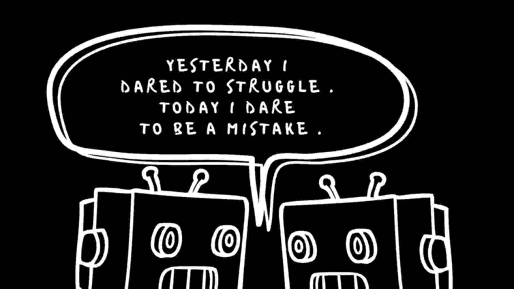

# Quotes by Machines

I made a small project with a python module by Max Woolf called textgenrnn. This repository contains the data related to the project. 

## Training data 
The training data was gotten from two sources. One being goodreads, specifically the  categories for philosophy and inspirational quotes. I used a web scraper to gather data from good reads (Filtering out non english quotes). The second came from [this repo](https://github.com/JamesFT/Database-Quotes-JSON/blob/master/quotes.json) containing quotes, I removed repeating quotes from here. In all the data is pretty comprehensive but you can run additional sanitization on it to improve the quality. You can find the final training data [here](./training_data/quotes.txt)

## Output data
After some experimentation I got some good outputs but It isn't all good as you can see [here](./outputs). The intelligible quotes are in the minority but those that are can turn out to really good.

### Links
- [Project link](https://quotesbymachines.xyz)
- [Textgenrnn](https://github.com/minimaxir/textgenrnn)
- [Tutorial](https://toberej.com/writings/generate-quotes-using-recurrent-neural-networks)